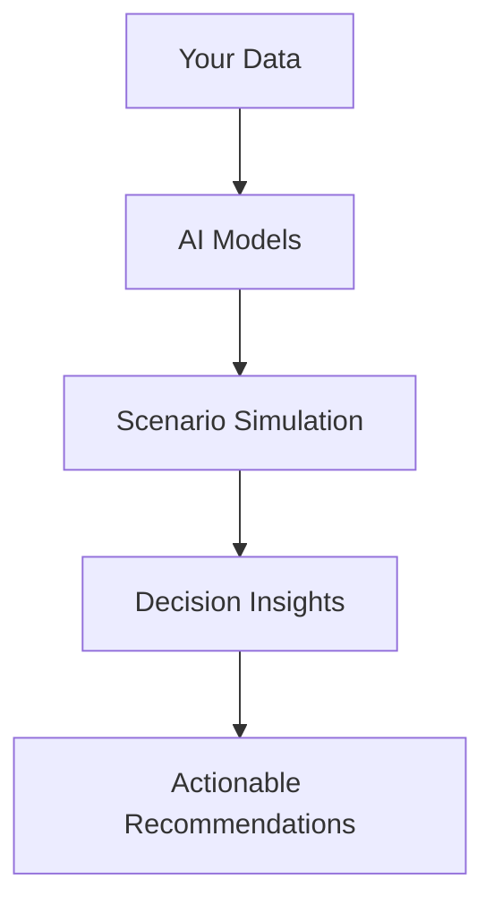

## Overview

Alchemetryx Consultation provides powerful tools tailored for owner-led businesses. You gain access to business systems optimization, decision intelligence analytics, and growth tracking modules. These features help you streamline operations, make data-driven decisions, and forecast sustainable growth. Integrate them seamlessly into your workflows to transform raw data into actionable insights.

<Callout kind="info">
  Start with the [Quickstart](/quickstart) guide to set up your Alchemetryx dashboard in under 5 minutes.
</Callout>

## Key Features

Discover the core capabilities through these highlighted features. Each module addresses specific challenges faced by owner-led businesses.

<Columns cols={3}>
  <Card title="Business Systems Optimization" icon="settings" href="#business-systems">
    Automate workflows and identify inefficiencies in your operations.
  </Card>
  <Card title="Decision Intelligence Analytics" icon="bar-chart-3" href="#decision-intelligence">
    Leverage AI-powered analytics for smarter, faster decisions.
  </Card>
  <Card title="Growth Tracking & Forecasting" icon="trending-up" href="#growth-tracking">
    Monitor key metrics and predict future performance accurately.
  </Card>
</Columns>

## Business Systems Optimization

Optimize your business processes with Alchemetryx's suite of tools. You map existing workflows, detect bottlenecks, and automate repetitive tasks. The platform analyzes your systems holistically, suggesting improvements based on industry benchmarks.

### Getting Started with Optimization

<Steps>
  <Step title="Connect Your Data Sources" icon="database">
    Link your CRM, ERP, and accounting tools to Alchemetryx.

````bash
alchemetryx connect --crm salesforce --api-key YOUR_API_KEY
````

  </Step>
  <Step title="Run System Audit" icon="search">
    Generate a comprehensive report on inefficiencies.

````javascript
const audit = await alchemetryx.audit({
  systems: ['crm', 'erp', 'accounting']
});
console.log(audit.bottlenecks);
````

  </Step>
  <Step title="Implement Recommendations" icon="zap">
    Apply automated fixes and monitor improvements.
  </Step>
</Steps>

## Decision Intelligence Analytics

Harness advanced analytics to inform every decision. Alchemetryx processes your data using machine learning models, providing scenario simulations and risk assessments.

<Tabs>
  <Tab title="Scenario Analysis" icon="activity">
    Simulate business decisions with what-if scenarios.

````javascript
const scenario = await alchemetryx.analyze.scenario({
  variable: 'marketing_budget',
  change: { from: 10000, to: 15000 },
  metrics: ['revenue', 'roi']
});
````

  </Tab>
  <Tab title="Risk Assessment" icon="alert-triangle">
    Evaluate potential risks across operations.

````python
import alchemetryx

risks = alchemetryx.risk_assess(
    data={'sales_forecast': forecast_data},
    thresholds={'revenue_drop': 0.1}
)
print(risks.summary)
````

  </Tab>
</Tabs>



## Growth Tracking and Forecasting

Track your business growth with precision. Alchemetryx's forecasting module uses historical data and market trends to project revenues, customer acquisition, and expansion opportunities.

<CodeGroup tabs="JavaScript,Python">
```javascript
const forecast = await alchemetryx.forecast({
  period: 'next_12_months',
  metrics: ['revenue', 'customers', 'churn']
});
console.log(forecast.projections);
```

```python
import alchemetryx as alc

forecast = alc.growth.forecast(
    historical_data=your_data,
    horizon='12M'
)
print(forecast.to_dataframe())
```
</CodeGroup>

| Metric          | Current Q4 | Forecast Q1 | Growth Rate |
|-----------------|------------|-------------|-------------|
| Revenue         | $250K     | $320K      | +28%       |
| Active Customers| 1,200     | 1,500      | +25%       |
| Monthly Churn   | 3.2%      | 2.8%       | -12%       |

<Callout kind="tip">
  Customize forecasts by integrating external data sources like market indices for higher accuracy.
</Callout>

## Real-World Use Cases

<ExpandableGroup>
  <Expandable title="Scaling Operations for a Manufacturing Firm" default-open="true">
    A family-owned manufacturer used Alchemetryx to optimize supply chain systems, reducing downtime by 40% and increasing throughput.
  </Expandable>
  <Expandable title="Strategic Decisions for a Consulting Agency">
    Decision analytics helped predict client retention, enabling proactive growth strategies that boosted revenue by 35%.
  </Expandable>
  <Expandable title="Forecasting Expansion for Retail Business">
    Growth modules forecasted optimal store locations, guiding a successful multi-site rollout.
  </Expandable>
</ExpandableGroup>

These features empower you to build resilient business systems. Explore the [Introduction](/introduction) for foundational concepts or dive into [Authentication](/authentication) for secure access setup.