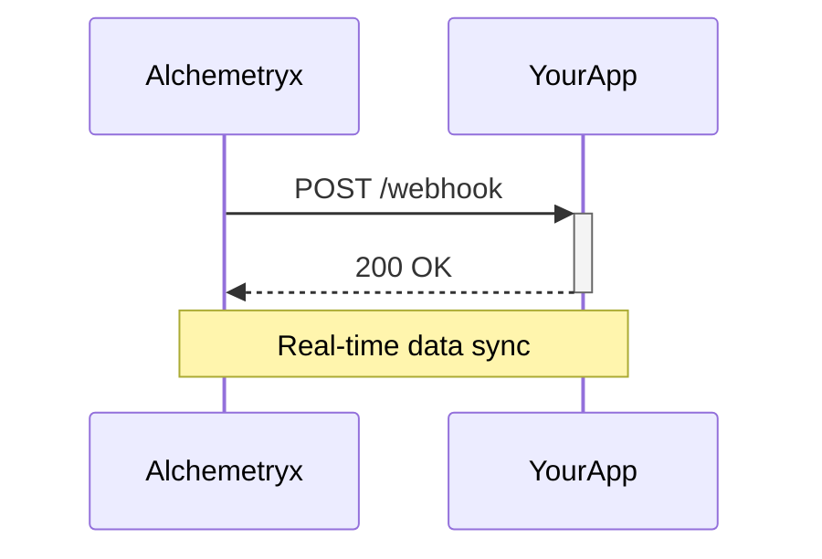

## Overview

Connect Alchemetryx Consultation to your business tools for seamless data synchronization. You gain real-time intelligence by integrating with CRMs, accounting software, and analytics platforms. This guide covers supported integrations, data connections, webhooks, and exports.

<Callout kind="info">
  All integrations use secure OAuth 2.0 or API keys. Review your tool's permissions before connecting.
</Callout>

## Supported Integrations

Alchemetryx supports key third-party services. Use the dashboard at `https://dashboard.example.com/integrations` to enable them.

<Columns cols={3}>
  <Card title="CRM Systems" icon="users" href="https://dashboard.example.com/integrations/crm">
    Connect Salesforce, HubSpot, or Pipedrive to sync customer data and decision insights.
  </Card>
  <Card title="Accounting" icon="dollar-sign" href="https://dashboard.example.com/integrations/accounting">
    Link QuickBooks, Xero, or Stripe for financial growth metrics.
  </Card>
  <Card title="Analytics" icon="bar-chart-3" href="https://dashboard.example.com/integrations/analytics">
    Integrate Google Analytics or Mixpanel to correlate user behavior with business intelligence.
  </Card>
</Columns>

| Integration | Type | Sync Frequency |
|-------------|------|----------------|
| Salesforce | CRM | Real-time |
| QuickBooks | Accounting | Hourly |
| Google Analytics | Analytics | Daily |

## Configuring Data Connections

Set up connections via the dashboard. Follow these steps for any integration.

<Steps>
  <Step title="Navigate to Integrations" icon="settings">
    Log in to `https://dashboard.example.com/integrations`.
  </Step>
  <Step title="Select Provider" icon="arrow-right">
    Choose your tool, like Salesforce.
  </Step>
  <Step title="Authorize Access" icon="key">
    Click "Connect" and grant OAuth permissions.
  </Step>
  <Step title="Configure Fields" icon="sliders">
    Map fields, such as customers to `{contact_id}`.
  </Step>
  <Step title="Test Connection" icon="check-circle">
    Run a test sync to verify data flow.
  </Step>
</Steps>

<Callout kind="tip">
  Start with minimal fields to test. Expand mappings after validation.
</Callout>

## Setting Up Automated Webhooks

Webhooks push Alchemetryx insights to your systems. Configure at `https://api.example.com/v1/webhooks`.

<Tabs>
  <Tab title="Slack" icon="message-circle">
    Send alerts for growth decisions.

    <CodeGroup tabs="cURL,JavaScript">
    ````bash
    curl -X POST https://api.example.com/v1/webhooks \
      -H "Authorization: Bearer YOUR_API_KEY" \
      -d '{
        "url": "https://hooks.slack.com/services/YOUR/SLACK/WEBHOOK",
        "events": ["decision_updated", "growth_insight"]
      }'
    ````
    ````javascript
    const response = await fetch('https://api.example.com/v1/webhooks', {
      method: 'POST',
      headers: {
        'Authorization': 'Bearer YOUR_API_KEY',
        'Content-Type': 'application/json'
      },
      body: JSON.stringify({
        url: 'https://hooks.slack.com/services/YOUR/SLACK/WEBHOOK',
        events: ['decision_updated', 'growth_insight']
      })
    });
    ````
    </CodeGroup>
  </Tab>
  <Tab title="Zapier" icon="zap">
    Automate workflows with Zapier.

    Use this zapier.com/alchemetryx trigger URL: `https://api.example.com/v1/webhooks/zapier/YOUR_ZAP_ID`.
  </Tab>
</Tabs>

## Exporting Insights to External Systems

Export decision data via API or CSV downloads.

<Request tabs="JavaScript,cURL" show-lines="true">
````javascript
const response = await fetch('https://api.example.com/v1/insights/export?format=json', {
  headers: { 'Authorization': 'Bearer YOUR_API_KEY' }
});
const insights = await response.json();
````
````bash
curl "https://api.example.com/v1/insights/export?format=json" \
  -H "Authorization: Bearer YOUR_API_KEY"
````
</Request>

<Response tabs="200">
````json
[
  {
    "id": "insight_123",
    "decision": "Expand marketing budget",
    "confidence": 0.92,
    "growth_impact": "+15%"
  }
]
````
</Response>

<ParamField path="format" param-type="string" required="false">
  Export format: `json` or `csv`.
</ParamField>

<ParamField header="Authorization" param-type="string" required="true">
  Bearer token: `YOUR_API_KEY`.
</ParamField>

## Advanced Webhook Flow



Use `<Expandable>` for troubleshooting if needed, but keep self-contained. You now integrate fully for enhanced business intelligence.