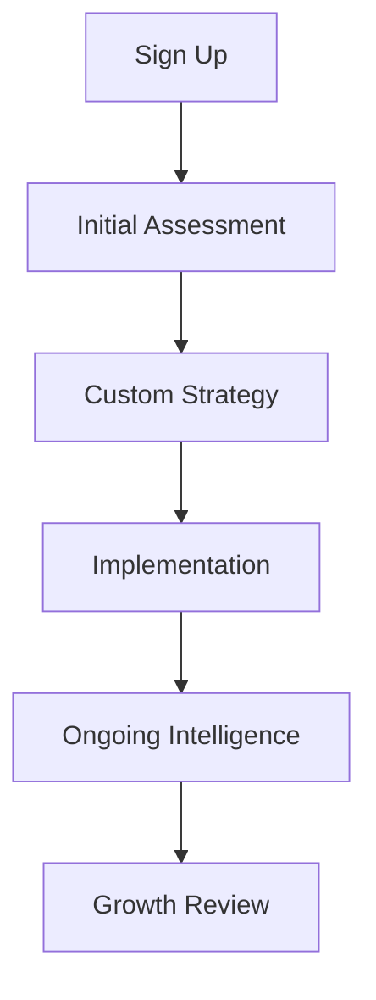

## Overview

Alchemetryx Consultation empowers owner-led businesses with tailored business systems, sharp decision intelligence, and proven growth strategies. You gain a dedicated partner that transforms complex operations into streamlined processes, turning data into actionable insights, and accelerating sustainable growth. Unlike generic consulting firms, Alchemetryx focuses exclusively on owner-led enterprises, understanding your unique challenges like wearing multiple hats and scaling without losing control.

## Key Features

Alchemetryx offers core features designed to supercharge your business:

<Columns cols={3}>
  <Card title="Business Systems" icon="settings" href="/docs/business-systems">
    Automate workflows, optimize operations, and build scalable systems that run without constant oversight.
  </Card>
  <Card title="Decision Intelligence" icon="bar-chart-3" href="/docs/decision-intelligence">
    Harness AI-driven analytics for data-backed decisions that minimize risks and maximize opportunities.
  </Card>
  <Card title="Growth Strategies" icon="trending-up" href="/docs/growth-strategies">
    Personalized playbooks for revenue growth, customer acquisition, and market expansion.
  </Card>
</Columns>

## Benefits for Owner-Led Enterprises

Tailored for solopreneurs and small teams, Alchemetryx delivers:

<Tabs>
  <Tab title="Time Savings" icon="clock">
    Reclaim 20+ hours weekly by automating repetitive tasks and gaining instant insights.
  </Tab>
  <Tab title="Revenue Boost" icon="dollar-sign">
    Clients see average 35% revenue growth in the first year through targeted strategies.
  </Tab>
  <Tab title="Risk Reduction" icon="shield">
    Proactive intelligence flags issues early, preventing costly mistakes.
  </Tab>
</Tabs>

<Callout kind="tip">
  Owner-led businesses thrive with Alchemetryx because we prioritize your vision and hands-on role—no corporate bureaucracy.
</Callout>

## How Alchemetryx Works



This streamlined process ensures rapid value delivery.

## Quick Start

Get up and running in minutes:

<Steps>
  <Step title="Create Account" icon="user-plus">
    Visit `https://dashboard.example.com` and sign up with your business email.
  </Step>
  <Step title="Schedule Consultation" icon="calendar">
    Book your free discovery call to align on goals.
  </Step>
  <Step title="Access Dashboard" icon="monitor">
    Log in and explore your personalized dashboard.
  </Step>
</Steps>

<CodeGroup tabs="JavaScript,Python">
  ```javascript
  // Fetch your first insights
  const response = await fetch('https://api.example.com/v1/insights', {
    headers: { Authorization: `Bearer ${YOUR_API_KEY}` }
  });
  const data = await response.json();
  console.log(data.recommendations);
  ```
  ```python
  # Fetch your first insights
  import requests
  response = requests.get(
      'https://api.example.com/v1/insights',
      headers={'Authorization': f'Bearer {YOUR_API_KEY}'}
  )
  print(response.json()['recommendations'])
  ```
</CodeGroup>

## Next Steps

<Columns cols={2}>
  <Card title="Business Systems Guide" icon="flowchart" href="/docs/business-systems">
    Dive into workflow automation.
  </Card>
  <Card title="Decision Tools" icon="brain" href="/docs/decision-intelligence">
    Master AI-powered insights.
  </Card>
</Columns>

<Expandable title="Frequently Asked Questions" default-open="true">
  **What makes Alchemetryx different?**  
  We specialize in owner-led businesses, delivering hands-on support without vendor lock-in.

  **How do I get my API key?**  
  Find it in your dashboard under Settings > API Access.
</Expandable>